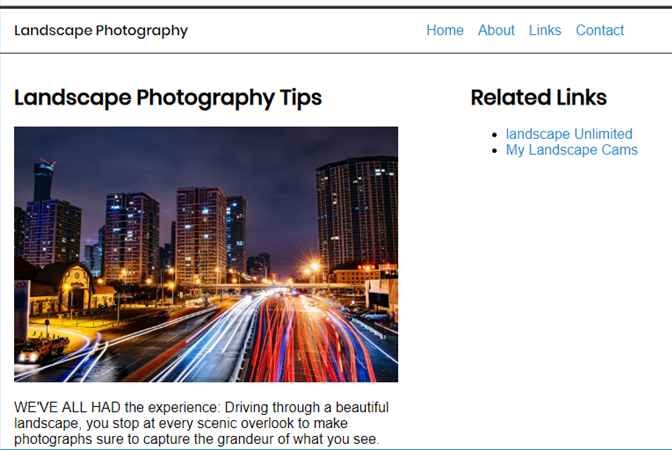

# HTML & CSS

## HTML

```html
<!DOCTYPE HTML>
<html>
<head>
    <meta charset="utf-8">
    <title>Your Website Title</title>
</head>
<body>
	Your Content
</body>
</html>
```

### HTML5 for Responsive Site

```html
<head>
...
<meta name="viewport" content="width=device-width, initial-scale=1">
...
</head>
```

## Modern Tools and Workflows

- Version Control System (VCS)
  - Git
- Code Editor
  - VS Code (Alternatively, WebStorm)
- Build Tools
  - npm & yarn
- Live Server
  - Live-server (live-reload, Browsersync)

## CSS

### CSS Selector

Learn CSS selector following [https://flukeout.github.io](https://flukeout.github.io/)

### CSS Specificity

**Learning Resource:**

1. CSS Specificity Infographic (CSS Specificity Wars) https://stuffandnonsense.co.uk/archives/css_specificity_wars.html
2. CSS Specificity Calculator <https://specificity.keegan.st/>
3. Specificity Visualizer  <https://isellsoap.github.io/specificity-visualizer/>
4. Learn
    1. <https://css-tricks.com/specifics-on-css-specificity/>
    2. <https://www.smashingmagazine.com/2007/07/css-specificity-things-you-should-know/>

**Cascading Rule**

1. Rules that are marked as important

2. Inline style rules

3. Rules containing IDs

4. Rules containing classes, attributes, and pseudo-classes

5. Rules containing elements and pseudo-elements

6. Inherited rules

7. Default values

### CSS Box Model

Learning

1. 1. <http://enjoycss.com>
   2. <http://guyroutledge.github.io/box-model/>

- Em
- Margins and padding
- Borders
- Box-sizing
- Display
- Position
- float and clear


https://medium.com/@DaphneWatson/css-box-model-for-beginners-45b93061c8e1

### Float


https://css-tricks.com/all-about-floats/

## CSS Layout

Interactive Learning CSS Layout

http://learnlayout.com


### Basic Layout with Float

#### News/Blog Website using Float

the output should be like this



#### Start coding!

1. write HTML only
2. Using font from URL such as google font
3. Normalize and reset
4. write css
5. add clearfix technique (modify CSS)

#### Final source code

```html
<!DOCTYPE html>
<html lang="en">
<head>
    <title>Landscape Photography</title>
    <meta charset="utf-8">
    <!-- <meta name="viewport" content="width=device-width, initial-scale=1"> -->
    <link href="normalize.css" rel="stylesheet">
    <!-- <link href="reset.css" rel="stylesheet"> -->
    <link href="01.css" rel="stylesheet">
    <link href="https://fonts.googleapis.com/css?family=Poppins:300,400,500" rel="stylesheet">
</head>
<body>

    <header class="clearfix">
        <div class="header__logo">Landscape Photography</div>
        <nav class="header__nav">
            <ul class="header__menu">
                <li><a href="/">Home</a></li>
                <li><a href="/about/">About</a></li>
                <li><a href="/links/">Links</a></li>
                <li><a href="/contact/">Contact</a></li>
            </ul>
        </nav>
    </header>
    <main class="clearfix">
        <article >
            <h2>Landscape Photography Tips</h2>
            
            <p>WE'VE ALL HAD the experience: Driving through a beautiful landscape, you stop at every scenic overlook to make photographs sure to capture the grandeur of what you see.</p>
            <p> You get home, look at the pictures, and find them flat and boring. All the elements that enthralled you at the time are there, but not the feeling. Why?</p>
            <p> When we look at a landscape, our eyes travel over it and selectively focus on the elements that we find appealing. Our field of vision encompasses a great deal of the scene, but our eyes and brains have the ability to ignore all except the most alluring details. Lenses and sensors or film cannot do this by themselves. They need help.</p>
            <a href="https://www.nationalgeographic.com/photography/photo-tips/landscape-photography-tips/">Originally Post</a>
        </article>
        <aside >
            <h2>Related Links</h2>
            <ul>
            <li><a href="https://www.flickr.com/search/?q=landscape">landscape Unlimited</a></li>
            <li><a href="https://www.flickr.com/photos/mildronize">My Landscape
            Cams</a></li>
            </ul>
        </aside>
</main>
    <footer>
        <p>&copy; 2018 Landscape Photography</p>
    </footer>
</body>
</html>
```

```css
/* 
Author: Thada Wangthammang 
Naming convention: BEM
*/

/*------------------------
[TABLE OF CONTENTS]
    
1. BASE

------------------------*/


.clearfix:before,
.clearfix:after {
    content: " ";
    display: table;
}

.clearfix:after {
    clear: both;
}

.clearfix {
    *zoom: 1;  /* For IE 6/7 (trigger hasLayout) */
}

/* BASE
----------------------*/
*,
::before,
::after {
  box-sizing: border-box;
}
body{
    font-size: 16px;
    font-family: Arial, Helvetica, sans-serif;
    padding: 0;
    margin: 0;
}

a {
    color: #1a8ed1;
    text-decoration: none;
}

a:hover,
a:focus {
    color: #002b5c;
}

h1, h2, h3, h4, h5, h6 {
    font-family: 'Poppins', sans-serif;
}

/* HEADER
----------------------*/

header {
    /* padding: 1rem 1rem 2rem; */
    padding: 1rem;
    border-top: 3px solid #333;
    border-bottom: 1px solid #333;
}

.header__logo {
    float: left;
    font-weight: 500;
    font-family: 'Poppins', sans-serif;
}

.header__nav {
    float: right;
}
.header__menu {
    display: inline;
    list-style-type: none;
}

.header__menu li{
    float: left;
    padding-left: 1em;
}


main article {
    margin: 1em;
    float: left;
    width: 57%;
}

main aside {
    margin: 1em;
    float: left;
    width: 28%;
}

footer { 
    margin: 1em;
    display: inline-block;
}
```

#### Checkpoint: สร้างเว็บ news/blog 3 คอลัมม์ โดยใช้ float


**Answer**

```html
<div class="submenu" >
    <h2>Submenu</h2>
    <ul>
        <li><a href="https://www.flickr.com/search/?q=landscape">landscape Unlimited</a></li>
        <li><a href="https://www.flickr.com/photos/mildronize">My Landscape</a></li>
    </ul>
</div>
```

```css
main .submenu {
    margin: 1em;
    float: left;
    /* width: 28%; */
}
```

## Learn More

**Learning Responsive Web Design**, Clarissa Peterson, O'Reilly Media, 2014

[https://](https://zendev.com/ultimate-guide-to-learning-css.html)[zendev.com/ultimate-guide-to-learning-css.html](https://zendev.com/ultimate-guide-to-learning-css.html)